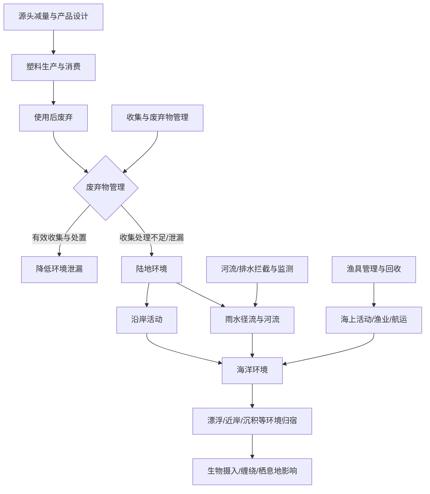

# 字段关系图

```mermaid
flowchart TD
 A[塑料生产与消费] --> B[使用后废弃]
 B --> C{废弃物管理}
 C -->|收集处理不足/泄漏| D[陆地环境]
 C -->|有效收集与处置| E[降低环境泄漏]
 D --> F[雨水径流与河流]
 D --> G[沿岸活动]
 H[海上活动/渔业/航运] --> I[海洋环境]
 F --> I
 G --> I
 I --> J[漂浮/近岸/沉积等环境归宿]
 J --> K[生物摄入/缠绕/栖息地影响]
 L[源头减量与产品设计] --> A
 M[收集与废弃物管理] --> C
 N[河流/排水拦截与监测] --> F
 O[渔具管理与回收] --> H
```

**注意：** 此图为概念关系图，不是定量流量图。箭头粗细不代表污染量；在获得可比数据之前，不标注百分比或质量流。
